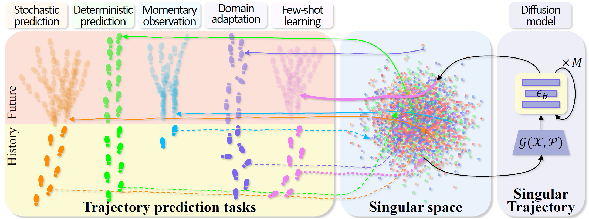

<h2 align="center">SingularTrajectory: Universal Trajectory Predictor Using Diffusion Model</h2>
<p align="center">
  <a href="https://InhwanBae.github.io/"><strong>Inhwan Bae</strong></a>
  ·  
  <a href="https://www.youngjaepark.com/"><strong>Young-Jae Park</strong></a>
  ·
  <a href="https://scholar.google.com/citations?user=Ei00xroAAAAJ"><strong>Hae-Gon Jeon</strong></a>
  <br>
  CVPR 2024
</p>

<p align="center">
  <a href="https://inhwanbae.github.io/publication/singulartrajectory/"><strong><code>Project Page</code></strong></a>
  <a href="https://arxiv.org/abs/2403.18452"><strong><code>CVPR Paper</code></strong></a>
  <a href="https://github.com/InhwanBae/SingularTrajectory"><strong><code>Source Code</code></strong></a>
  <a href="#-citation"><strong><code>Related Works</code></strong></a>
</p>

<div align='center'>
  <br>
  <br>An overview of our SingularTrajectory framework.
</div>

<br>This repository contains the code for the SingularTrajectory model, designed to handle five different trajectory prediction benchmarks.
<br>Our unified framework ensures the general dynamics of human movements across various input modalities and trajectory lengths.

<br>

## 1️⃣ SingularTrajectory Model 1️⃣
* A diffusion-based universal trajectory prediction framework designed to bridge the performance gap across five tasks.
* A Singular space is constructed to unify various representations of human dynamics in the associated tasks.
* An adaptive anchor and cascaded denoising process correct initial prototype paths that are placed incorrectly.
* Our model outperforms on five public benchmarks: Deterministic, Stochastic, Domain Adaptation, Momentary Observation, and Few-Shot.
 
<br>

## Model Training
### Setup
**Environment**
<br>All models were trained and tested on Ubuntu 20.04 with Python 3.8 and PyTorch 2.0.1 with CUDA 11.7.

**Dataset**
<br>Preprocessed [ETH](https://data.vision.ee.ethz.ch/cvl/aem/ewap_dataset_full.tgz) and [UCY](https://graphics.cs.ucy.ac.cy/research/downloads/crowd-data) datasets are released in this repository. 
The train/validation/test splits are the same as those fond in [Social-GAN](https://github.com/agrimgupta92/sgan).

You can download the dataset by running the following script.
```bash
./scripts/download_datasets.sh
```

### Train SingularTrajectory
To train our SingularTrajectory on each task using the ETH and UCY datasets simultaneously, we provide a bash script `train.sh` for simplified execution.
```bash
./scripts/train.sh -p <config_path> -t <experiment_tag> -d <space_seperated_dataset_string> -i <space_seperated_gpu_id_string>
```

**Examples**
```bash
# Stochastic prediction task
./script/train.sh -p stochastic/singulartrajectory -t SingularTrajectory-stochastic

# Deterministic prediction task
./script/train.sh -p deterministic/singulartrajectory -t SingularTrajectory-deterministic

# Momentary observation task
./script/train.sh -p momentary/singulartrajectory -t SingularTrajectory-momentary

# Domain adaptation task
./script/train.sh -p domain/singulartrajectory -t SingularTrajectory-domain -d "A2B A2C A2D A2E B2A B2C B2D B2E C2A C2B C2D C2E D2A D2B D2C D2E E2A E2B E2C E2D" -i "0 0 0 0 1 1 1 1 2 2 2 2 3 3 3 3 4 4 4 4"

# Few-shot task
./script/train.sh -p fewshot/singulartrajectory -t SingularTrajectory-fewshot

# (Optional) Stochastic domain adaptation task
./script/train.sh -p domain-stochastic/singulartrajectory -t SingularTrajectory-domain-stochastic -d "A2B A2C A2D A2E B2A B2C B2D B2E C2A C2B C2D C2E D2A D2B D2C D2E E2A E2B E2C E2D" -i "0 0 0 0 1 1 1 1 2 2 2 2 3 3 3 3 4 4 4 4"

# (Optional) All-in-one task
./script/train.sh -p allinone/singulartrajectory -t SingularTrajectory-allinone -d "A2B A2C A2D A2E B2A B2C B2D B2E C2A C2B C2D C2E D2A D2B D2C D2E E2A E2B E2C E2D" -i "0 0 0 0 1 1 1 1 2 2 2 2 3 3 3 3 4 4 4 4"
```
If you want to train the model with custom hyperparameters, use `trainval.py` instead of the script file.
```bash
python trainval.py --cfg ./config/{task}/singulartrajectory-transformerdiffusion-{dataset}.json --tag SingularTrajectory-{task} --gpu_id 0 
```

<br>

## Model Evaluation
### Pretrained Models
We provide pretrained models in the [**release section**](https://github.com/InhwanBae/SingularTrajectory/releases/tag/v1.0). 
You can download all pretrained models at once by running the script. This will download the 80 SingularTrajectory models.
```bash
./scripts/download_pretrained_models.sh
```

### Evaluate SingularTrajectory
To evaluate our EigenTrajectory at once, we provide a bash script `test.sh` for a simplified execution.
```bash
./scripts/test.sh -p <config_path> -t <experiment_tag> -d <space_seperated_dataset_string> -i <space_seperated_gpu_id_string>
```

**Examples**

```bash
# Stochastic prediction task
./script/test.sh -p stochastic/singulartrajectory -t SingularTrajectory-stochastic

# Deterministic prediction task
./script/test.sh -p deterministic/singulartrajectory -t SingularTrajectory-deterministic

# Momentary observation task
./script/test.sh -p momentary/singulartrajectory -t SingularTrajectory-momentary

# Domain adaptation task
./script/test.sh -p domain/singulartrajectory -t SingularTrajectory-domain -d "A2B A2C A2D A2E B2A B2C B2D B2E C2A C2B C2D C2E D2A D2B D2C D2E E2A E2B E2C E2D" -i "0 0 0 0 1 1 1 1 2 2 2 2 3 3 3 3 4 4 4 4"

# Few-shot task
./script/test.sh -p fewshot/singulartrajectory -t SingularTrajectory-fewshot

# (Optional) Stochastic domain adaptation task
./script/test.sh -p domain-stochastic/singulartrajectory -t SingularTrajectory-domain-stochastic -d "A2B A2C A2D A2E B2A B2C B2D B2E C2A C2B C2D C2E D2A D2B D2C D2E E2A E2B E2C E2D" -i "0 0 0 0 1 1 1 1 2 2 2 2 3 3 3 3 4 4 4 4"

# (Optional) All-in-one task
./script/test.sh -p allinone/singulartrajectory -t SingularTrajectory-allinone -d "A2B A2C A2D A2E B2A B2C B2D B2E C2A C2B C2D C2E D2A D2B D2C D2E E2A E2B E2C E2D" -i "0 0 0 0 1 1 1 1 2 2 2 2 3 3 3 3 4 4 4 4"
```

If you want to evaluate the model individually, you can use `trainval.py` with custom hyperparameters. 
```bash
python trainval.py --test --cfg ./config/{task}/singulartrajectory-transformerdiffusion-{dataset}.json --tag SingularTrajectory-{task} --gpu_id 0
```

<br>

## 📖 Citation
If you find this code useful for your research, please cite our trajectory prediction papers :)

[**`💬 LMTrajectory (CVPR'24) 🗨️`**](https://github.com/InhwanBae/LMTrajectory) **|**
[**`1️⃣ SingularTrajectory (CVPR'24) 1️⃣`**](https://github.com/InhwanBae/SingularTrajectory) **|**
[**`🌌 EigenTrajectory (ICCV'23) 🌌`**](https://github.com/InhwanBae/EigenTrajectory) **|** 
[**`🚩 Graph‑TERN (AAAI'23) 🚩`**](https://github.com/InhwanBae/GraphTERN) **|**
[**`🧑‍🤝‍🧑 GP‑Graph (ECCV'22) 🧑‍🤝‍🧑`**](https://github.com/InhwanBae/GPGraph) **|**
[**`🎲 NPSN (CVPR'22) 🎲`**](https://github.com/InhwanBae/NPSN) **|**
[**`🧶 DMRGCN (AAAI'21) 🧶`**](https://github.com/InhwanBae/DMRGCN)

```bibtex
@inproceedings{bae2024singulartrajectory,
  title={SingularTrajectory: Universal Trajectory Predictor Using Diffusion Model},
  author={Bae, Inhwan and Park, Young-Jae and Jeon, Hae-Gon},
  booktitle={Proceedings of the IEEE/CVF Conference on Computer Vision and Pattern Recognition},
  year={2024}
}
```
<details>
  <summary>More Information (Click to expand)</summary>

```bibtex
@inproceedings{bae2024lmtrajectory,
  title={Can Language Beat Numerical Regression? Language-Based Multimodal Trajectory Prediction},
  author={Bae, Inhwan and Lee, Junoh and Jeon, Hae-Gon},
  booktitle={Proceedings of the IEEE/CVF Conference on Computer Vision and Pattern Recognition},
  year={2024}
}

@inproceedings{bae2023eigentrajectory,
  title={EigenTrajectory: Low-Rank Descriptors for Multi-Modal Trajectory Forecasting},
  author={Bae, Inhwan and Oh, Jean and Jeon, Hae-Gon},
  booktitle={Proceedings of the IEEE/CVF International Conference on Computer Vision},
  year={2023}
}

@article{bae2023graphtern,
  title={A Set of Control Points Conditioned Pedestrian Trajectory Prediction},
  author={Bae, Inhwan and Jeon, Hae-Gon},
  journal={Proceedings of the AAAI Conference on Artificial Intelligence},
  year={2023}
}

@inproceedings{bae2022gpgraph,
  title={Learning Pedestrian Group Representations for Multi-modal Trajectory Prediction},
  author={Bae, Inhwan and Park, Jin-Hwi and Jeon, Hae-Gon},
  booktitle={Proceedings of the European Conference on Computer Vision},
  year={2022}
}

@inproceedings{bae2022npsn,
  title={Non-Probability Sampling Network for Stochastic Human Trajectory Prediction},
  author={Bae, Inhwan and Park, Jin-Hwi and Jeon, Hae-Gon},
  booktitle={Proceedings of the IEEE/CVF Conference on Computer Vision and Pattern Recognition},
  year={2022}
}

@article{bae2021dmrgcn,
  title={Disentangled Multi-Relational Graph Convolutional Network for Pedestrian Trajectory Prediction},
  author={Bae, Inhwan and Jeon, Hae-Gon},
  journal={Proceedings of the AAAI Conference on Artificial Intelligence},
  year={2021}
}
```
</details>

### Acknowledgement
Part of our code is borrowed from [EigenTrajectory](https://github.com/InhwanBae/EigenTrajectory) and [LED](https://github.com/MediaBrain-SJTU/LED).
We thank the authors for releasing their code and models.

<br>
